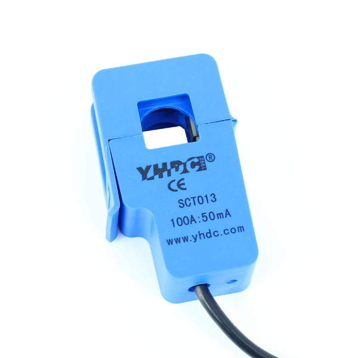

# Projeto_Final
Sistema de segurança para Equipamentos Elétricos

#### O presente projeto foi elaborado utilizando a plataforma do QT CREATOR, e tem como finalidade a composição de nota da disciplina técnicas de programação 2019.2

#### O objetivo do projeto é monitorar valores de corrente de um determinado equipamento elétrico protegendo o mesmo de sobrecarga de corrente.

### Material utilizado 
 #### -2 sensores de corrente não invasivos   
 #### -2 LEDs
 #### -2 Resistores de 330 ohms
 #### -1 protoboard
 #### -1 modúlo NodeMCU
 #### -Fios
 
 Hub Logo](imagens/.png )
 
 #### O sensor de corrente não invasivo utilizado nesse projeto tem a capacidade de medir corrente de até 100 A
 

   
  ####          -Por fim o aplicativo é direcionado para aqueles que desejam proteger seus circuitos de sobrecargas.
  
 ## Obrigado!
