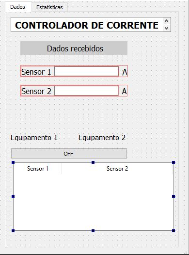
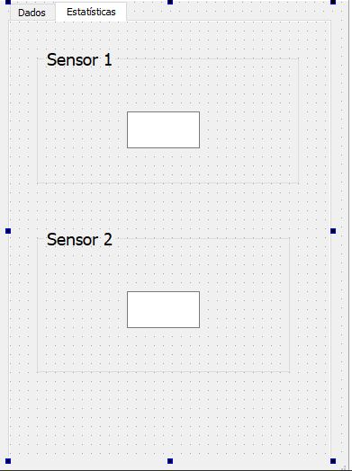
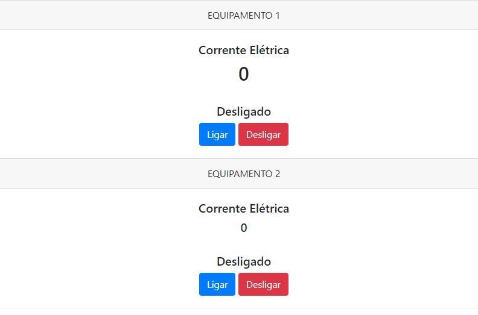
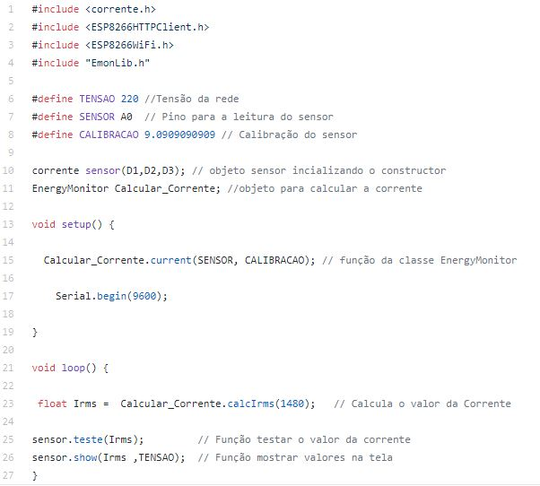
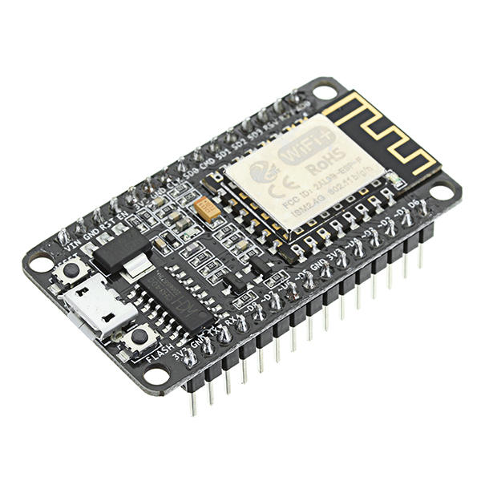

# Projeto_Final
Sistema de segurança para Equipamentos Elétricos

##### O presente projeto foi elaborado utilizando a plataforma do QT CREATOR, e tem como finalidade a composição de nota da disciplina técnicas de programação 2019.2

##### O objetivo do projeto é monitorar valores de corrente de um determinado equipamento elétrico protegendo o mesmo de sobrecarga de corrente.

## Material utilizado 
 ##### -2 sensores de corrente não invasivos   
 ##### -6 LEDs
 ##### -4 Resistores de 10 k 
 ##### -2 Resistores de 330 ohms
 ##### -1 protoboard
 ##### -1 modúlo NodeMCU
 ##### -Fios jumper
 

 
 ##### O sensor de corrente não invasivo utilizado nesse projeto tem a capacidade de medir corrente de até 100 A
 
 ##### Foi implementado uma condição de corrente máxima determinado pelas caracteristícas do sistema a ser observado, caso a corrente exceda esse limite um relé será acionado atribuindo nível lógico baixo na saída (LOW) interronpendo o funcionamento do sistema.
 
 ### Os valores dos sensores serão enviados para uma aplicação criada no QT CREATOR  e um página web.
 
 
 
 ### O cliente poderá monitar sua aplicação visualizando estatísitcas e os valores medidos.
 
 
###  Uma das maiores vantangens é o monitoramento a distância feito a parti do navergador de qualquer lugar do mundo.

 
 
 ### A lógica da aplicação foi criada na IDE do arduino onde foram desenvolvidos 3 arquivos, um arquivo sendo o programa principal, um contendo o cabeçario também conhecido como biblioteca e por último as implementações da biblioteca.
 
 
 
###  Utilizamos o NodeMCU ESP8266 que tem a vantangem de conter um módulo WIFI capaz de se comunicar com uma rede web.

   
  ###          -Por fim o aplicativo é direcionado para aqueles que desejam proteger seus circuitos de sobrecargas.
  
 ## Obrigado!
